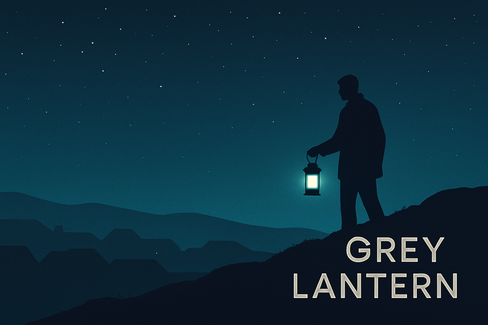

<!-- Banner -->

  

# 🌌 Grey Lantern Lab

**Open-source intelligence | Digital investigations**  
Building a publicly accessible portfolio exploring tools, workflows, case projects and investigative reflections.

---

### 🕯️ About Grey Lantern
Grey Lantern is an alias identity focused on structured OSINT learning, ethical investigation and quiet, methodical discovery.  
This lab collects the results of my study route, practical exercises, case projects and personal tooling.

I explore topics such as:

- OSINT fundamentals  
- Website & domain investigations  
- Digital footprinting  
- Human analysis & pattern recognition  
- Disinformation mapping  
- AML-adjacent intelligence  
- Story-driven reporting  
- OSINT network analysis  
- Trend analysis & narrative analysis

---

### 📂 Repositories

#### 🔹 **greys-notes**
Short analyses, reasoning structures, insights, frameworks and thought experiments.

#### 🔹 **greys-workflows**
OSINT workflows and repeatable investigation patterns.

#### 🔹 **greys-tools**
Small tools, scripts, snippets and practical utilities.

#### 🔹 **greys-caseprojects**
Case project #1 – *The Digital Shadow*: website & domain investigations, footprints, patterns and reflections.

#### 🔹 **greys-library**
Reading notes, summaries and reference material.

---

### 🧭 Purpose
To document a multi-year OSINT learning journey, build skill through practice, and maintain a clean, transparent and useful record of progress — openly, but under an alias.

---

### 🛰️ Connect
You can find **GreyLanternLab** on:

- **Discord** (community presence)  
- **Mastodon** (to be added)

---

### 📂 Repositories  
- [greys-notes](https://github.com/GreyLanternLab/greys-notes)  
- [greys-workflows](https://github.com/GreyLanternLab/greys-workflows)  
- [greys-tools](https://github.com/GreyLanternLab/greys-tools)  
- [greys-caseprojects](https://github.com/GreyLanternLab/greys-caseprojects)  
- [greys-library](https://github.com/GreyLanternLab/greys-library)  

### 🕯️ *Light in the dark; structure in the noise.*
